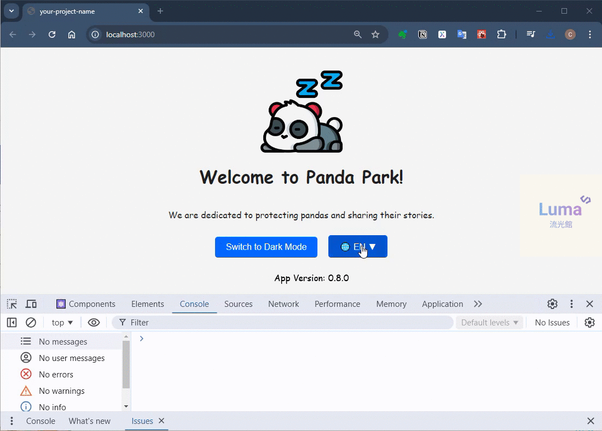

# React Webpack Starter

This repository serves as a starter template for building React applications with Webpack. It provides a robust setup for developers who want to get started quickly with React and Webpack, including support for JSX, ES6+, hot module replacement, and advanced log management for performance monitoring.

## Features

- 🌓 Dark/Light Theme Switching: Toggle between light and dark modes.
- 🌐 Multi-Language Support: Easily switch between English and Chinese.
- 🔄 Dynamic Updates: Instant changes for both theme and language settings.
- 🛠️ Modularized Structure: Components and pages are organized for clarity and maintainability.
- 🧭 React Router for Navigation: Seamless page navigation with React Router for SPA functionality.
- n📊 Log Level Control: Manage log levels (DEBUG, INFO, WARN, ERROR) dynamically based on the environment, optimizing performance.


## Project Structure

```bash
react-webpack-starter/
├── public/                 # Static files
├── src/                    # React source code
│   ├── assets/             # Assets (images, fonts, etc.)
│   ├── components/         # React components
│   │   ├── Layout.jsx      # Layout component with navigation and footer
│   ├── pages/              # Page-level components
│   │   ├── HomePage.jsx    # Home page with navigation to stages
│   │   ├── BasicStage.jsx  # Basic stage page
│   │   ├── IntermediateStage.jsx # Intermediate stage page
│   ├── styles/             # Global styles
│   ├── utils/              # Utility functions and helpers
│   │   ├── i18n.js         # Language configuration
│   │   └── config.js       # Application configuration
│   ├── App.js              # Main application component
├── docs/                   # Images for README and documentation
├── README.md               # Project documentation
├── package.json            # Project configuration
└── webpack.config.js       # Webpack configuration
```

## Getting Started

### Prerequisites

Ensure you have [Node.js](https://nodejs.org/) installed.

### Installation

1. Clone the repository:

   ```bash
   git clone https://github.com/your-username/react-webpack-starter.git
   cd react-webpack-starter
   ```
2. Install dependencies:
   ```bash
   npm install
   git submodule update --init --recursive
   npm run link-fonts
   ```
3. Running the Development Server
   ```bash
   npm start
   ```
4. Building for Production
   ```bash
   npm build
   ```

### Usage

Once the application is running, open http://localhost:3000 in your browser and you can:

- Switch between Light Mode and Dark Mode by clicking the toggle button.
- Switch between English and Chinese by clicking the toggle button.
- Enjoy optimized performance with dynamic log level control based on the config.js.
- Navigate between different stages (Home, Basic Stage, Intermediate Stage) using React Router.


### Screenshots

Here is an example of how the application looks:


### Contribution

Contributions are welcome! Feel free to open issues or submit pull requests if you have any suggestions or improvements.

